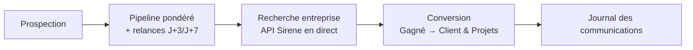

# Playbook — Freelance Pipeline CRM

> Guide opératoire structuré en 4 volets (Définitions / Process / Documentation / Templates).
> Particularité de ce projet : contrairement aux autres démos du portfolio (données simulées),
> les modules Recherche entreprise et Radar Normandie interrogent une **vraie API publique en
> direct** (Sirene, gouv.fr) — pas de données inventées sur ces deux volets.

---

## 1. Définitions

| Terme | Définition |
|---|---|
| **Pipeline pondéré** | Valeur du pipeline ajustée par la probabilité de conversion de chaque statut |
| **Relance J+3/J+7** | Règle de suivi automatique : relancer un prospect 3 puis 7 jours après le dernier contact sans réponse |
| **Sirene** | Annuaire officiel des entreprises françaises (API gratuite, sans clé) |
| **Veille BOAMP** | Surveillance des marchés publics (Bulletin Officiel des Annonces de Marchés Publics) |

## 2. Process

1. **Pipeline** — suivi des prospects par statut, valeur pondérée par probabilité de conversion.
2. **Recherche entreprise** — annuaire Sirene interrogé en direct (cache 1h), suggestion d'offre selon le profil, radar sectoriel santé/médico-social par département (Radar Normandie).
3. **Conversion** — un prospect "Gagné" devient un client avec son propre suivi de mission (tâches/échéances), pas juste un statut fermé.
4. **Communication** — journal des échanges par prospect/client (canal, résumé, prochaine action) — pas d'envoi automatique de message, un journal de suivi.

**Point de décision réutilisable** : appeler l'API en direct à chaque rendu plutôt que d'importer un jeu de données figé — garantit qu'aucun chiffre montré en démo n'est jamais périmé ou inventé, argument de crédibilité fort face à un prospect qui regarde le code.

## 3. Documentation

- [`README.md`](README.md) — présentation courte, rappel "aucune donnée réelle en dur dans le code"

## 4. Templates réutilisables

- **`research.py` / `radar_normandie.py`** — pattern d'appel à une API publique gratuite avec cache, réutilisable pour tout enrichissement d'annuaire ou de veille sectorielle.
- **`n8n/veille_boamp_malt.json`** — workflow n8n exporté, veille automatisée des marchés publics : template directement important dans n8n pour toute veille similaire.
- **`messaging.py` / `clients.py`** — pattern de journal de suivi + bascule prospect → client avec gestion de projet légère, transposable à tout CRM simplifié.

**Règle de transposition** : ce projet démontre la capacité à construire un outil connecté à des données réelles (pas seulement des POC simulés) — à mettre en avant spécifiquement pour des missions qui demandent une intégration API, pas uniquement du dashboarding.

---

*Gisèle Metouck — Consultante Data Steward & Gouvernance · [GitHub](https://github.com/Kingdmfncr)*
